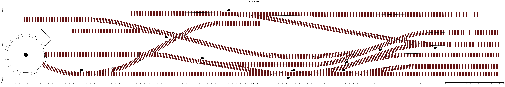

# Southside Connecting

This is an XTrkCAD  version of Railroad C:  "Southside  Connecting"  from "Six
Atlas HO  Railroads  You Can Build",  Atlas book #13, 2nd  edition, by John H.
Armstrong and Thaddeus Stepok.

This plan is slightly adjusted from the original and uses flextrack

